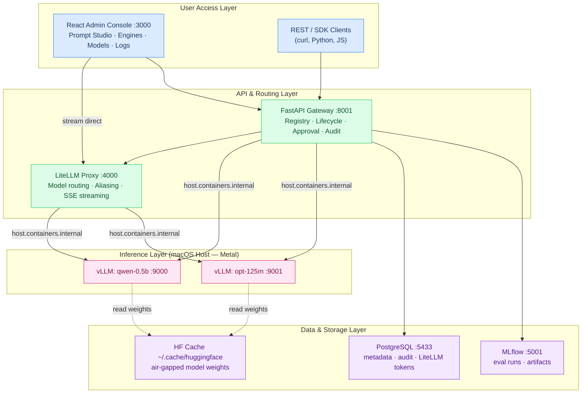
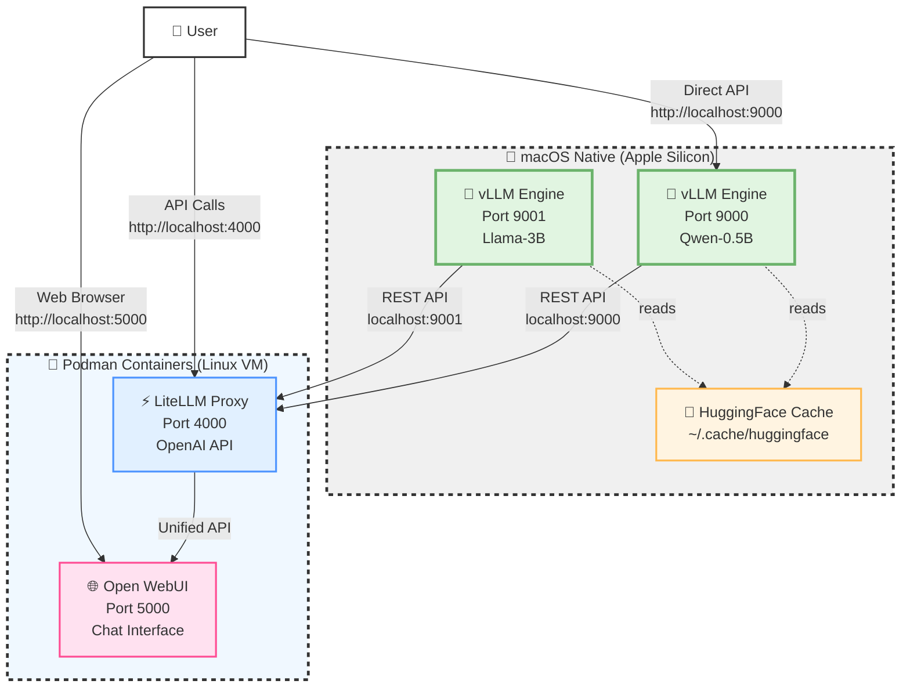

# LLMOps Platform — Self-Hosted, Air-Gapped LLM Operations

Enterprise-grade LLM operations platform for regulated environments. Runs entirely on-premises with Apple Silicon (Metal) or CUDA GPU acceleration. No cloud dependency.

> **Status (2026-02-26):** Phases 0–4 complete and E2E validated. Qwen2.5-0.5B-Instruct serving live with streaming responses confirmed in Prompt Studio.  
> Phase 5 (Enterprise Hardening — RBAC/SSO, Grafana, Air-gap cert) starting now.  
> See [PLATFORM_ARCHITECTURE.md](PLATFORM_ARCHITECTURE.md) for the full design document.

---

## 🎯 Platform Overview

A full-stack LLMOps platform built layer by layer:

| Layer | Components | Status |
|---|---|---|
| **Inference** | vLLM engines on macOS host (Metal acceleration) | ✅ Live |
| **Gateway** | LiteLLM proxy — OpenAI-compatible routing + model aliasing | ✅ Live |
| **API** | FastAPI — model registry, engine lifecycle, approval workflow, audit log | ✅ Live |
| **UI** | React Admin Console — Prompt Studio, Engines, Models, Deployments, Logs | ✅ Live |
| **Auth** | JWT bearer tokens + role claims (admin / operator / viewer) | ✅ Live |
| **Observability** | Prometheus metrics from vLLM, reconciler health checks | ✅ Live |
| **Governance** | Approval gates, MLflow eval tracking, immutable audit log | ✅ Live |
| **Enterprise** | RBAC/SSO, Grafana, Air-gap cert package | 🔄 Phase 5 |

### Access Points

| Service | URL | Credentials |
|---|---|---|
| Admin Console | http://localhost:3000 | `admin@llmops.local` / `changeme` |
| FastAPI docs | http://localhost:8001/docs | Bearer token from `/v1/auth/token` |
| LiteLLM proxy | http://localhost:4000 | `sk-llmops-master-key-change-me` |
| MLflow | http://localhost:5001 | — |
| LiteLLM Admin | http://localhost:4000/ui | — |

---

## 🏗️ Architecture

### Platform Architecture (Phases 0–4 Complete)



**Quick Links:**

- [🚀 Platform Quick Start](#-platform-quick-start) — full stack in 3 steps
- [🔧 Phase 0 TUI Tools](#-phase-0-tui-tools) — bash script model/engine managers
- [📖 API Usage](#-api-usage) — curl examples against the platform
- [🐳 Container Setup](#-dockerpodman-deployment-optional) — Podman compose details
- [🔧 Troubleshooting](#-troubleshooting) — common issues

---

## 🚀 Platform Quick Start

### Step 1 — Start all platform containers

```bash
cd platform
podman-compose up -d
```

All 8 services start: `api`, `ui`, `litellm`, `postgres`, `redis`, `mlflow`, `nginx`, `open-webui`.

### Step 2 — Start a vLLM engine on the host

```bash
# Requires vllm_env with vLLM installed
mkdir -p /tmp/vllm_logs
QWEN_PATH=$(python3 -c "
from huggingface_hub import snapshot_download
print(snapshot_download('Qwen/Qwen2.5-0.5B-Instruct', local_files_only=True))
")
LOG_FILE="/tmp/vllm_logs/engine_qwen-0.5b_9000_$(date +%Y%m%dT%H%M%S).log"
nohup vllm_env/bin/python -m vllm.entrypoints.openai.api_server \
  --model "$QWEN_PATH" --served-model-name qwen-0.5b \
  --host 0.0.0.0 --port 9000 \
  --dtype bfloat16 --gpu-memory-utilization 0.5 --max-model-len 2048 \
  > "$LOG_FILE" 2>&1 &
echo "vLLM started, PID=$!, log: $LOG_FILE"
```

### Step 3 — Register and activate the model via UI

1. Open http://localhost:3000 → login `admin@llmops.local` / `changeme`
2. **Models** → Register → fill repo ID `Qwen/Qwen2.5-0.5B-Instruct`, alias `qwen-0.5b`
3. **Approvals** → request approval → approve
4. **Engines** → the reconciler auto-detects the running engine on port 9000 within 30s
5. **Deployments** → Sync Now → model appears in LiteLLM
6. **Prompt Studio** → select `qwen-0.5b` → type a prompt → click Run → tokens stream in real-time

---

## 🔧 Phase 0 TUI Tools

> These bash scripts remain the fastest demo vehicle. Use them to download models and start engines independently of the platform API.

### Hybrid Architecture (Native + Container)

This project uses a **hybrid architecture** for optimal performance on macOS:



### Why Hybrid Architecture?

**❌ Initial Approach (All Containers):**

- vLLM running in Podman container (Linux VM)
- **Problem**: Poor performance due to:
  - Podman Machine runs Linux VM on macOS
  - No native Metal acceleration
  - Extra virtualization overhead
  - 50-70% slower inference

**✅ Current Approach (Hybrid):**

- **vLLM Native**: Runs directly on macOS
  - Full Metal/CPU acceleration
  - No virtualization overhead
  - Native ARM64 performance
  - 2-3x faster inference
  
- **LiteLLM + Open WebUI**: Stay in containers
  - Lightweight proxy services
  - Easy port management
  - Isolated dependencies
  - Simple updates

### Air-Gap Architecture for Regulated Environments

For sensitive/regulated customers requiring fully offline deployment:

```mermaid
flowchart LR
    subgraph internet["🌐 Internet-Connected Machine"]
        direction TB
        download["📥 Download Phase"]
        hf["🤗 HuggingFace Hub"]
        models["📦 Models Downloaded"]
        
        download -->|"hf-model-manager.sh"| hf
        hf -->|"Save to cache"| models
        
        style download fill:#e1f5e1,stroke:#6cb36c,stroke-width:2px
        style hf fill:#fff4e1,stroke:#ffb84d,stroke-width:2px
        style models fill:#e1f0ff,stroke:#4d94ff,stroke-width:2px
    end
    
    transfer["💾 Transfer<br/>USB/Network<br/>tar.gz archive"]
    
    subgraph airgap["🔒 Air-Gapped Machine (No Internet)"]
        direction TB
        cached["📦 Cached Models<br/>~/.cache/huggingface"]
        vllm_ag["🚀 vLLM Native<br/>Inference Engines"]
        litellm_ag["⚡ LiteLLM Proxy<br/>(Container)"]
        ui_ag["🌐 Open WebUI<br/>(Container)"]
        
        cached --> vllm_ag
        vllm_ag --> litellm_ag
        litellm_ag --> ui_ag
        
        style cached fill:#fff4e1,stroke:#ffb84d,stroke-width:2px
        style vllm_ag fill:#e1f5e1,stroke:#6cb36c,stroke-width:3px
        style litellm_ag fill:#e1f0ff,stroke:#4d94ff,stroke-width:2px
        style ui_ag fill:#ffe1f0,stroke:#ff4d94,stroke-width:2px
    end
    
    models -.->|"Offline"| transfer
    transfer -.->|"Extract"| cached
    
    customer["👤 Regulated Customer<br/>Healthcare/Finance/Gov"]
    customer -->|"Secure Access"| ui_ag
    
    style internet fill:#f0f8ff,stroke:#333,stroke-width:3px
    style airgap fill:#fff0f0,stroke:#ff4d4d,stroke-width:3px,stroke-dasharray: 5 5
    style transfer fill:#f0f0f0,stroke:#666,stroke-width:2px
    style customer fill:#fff,stroke:#333,stroke-width:2px
```



**Key Benefits:**

- ✅ **Zero Internet Dependency**: All models cached locally
- ✅ **Data Privacy**: Inference runs completely offline
- ✅ **Compliance Ready**: HIPAA, SOC2, FedRAMP compatible
- ✅ **Fast Performance**: Native macOS vLLM execution
- ✅ **Easy POC/Demo**: Quick setup for customer validation

### Architecture Evolution

**Version 1.0 (All Containers)** ❌
```
All services in Podman → Linux VM overhead → Poor vLLM performance
```

**Version 2.0 (Hybrid - Current)** ✅
```
vLLM Native + LiteLLM/UI Containers → Best of both worlds
```

**Why This Matters:**

- Initial tests showed **50-70% slower** inference when vLLM ran in containers
- Podman Machine uses QEMU for Linux VM, no Metal acceleration
- Native ARM64 execution provides **2-3x speed improvement**
- Containers retained for lightweight proxy/UI services
- Result: **Production-ready performance** with **easy management**

## ✨ Features

- 🚀 **Native Apple Silicon Support** - Uses Metal/CPU acceleration
- 🤗 **Easy Model Management** - Browse, download, and manage HuggingFace models
- 🔄 **Multi-Engine Support** - Run multiple models simultaneously on different ports
- 📊 **Real-time Monitoring** - Track running engines with PID, port, and model info
- 📝 **Automatic Logging** - All engine output captured to log files
- 🔐 **Corporate SSL Support** - Handles corporate certificates for HuggingFace downloads
- 🎨 **Beautiful TUI** - Colorful, intuitive command-line interface

## 📋 Prerequisites

- **Hardware**: Mac M1/M2/M3 with 16GB+ RAM (32GB recommended)
- **Software**:
  - Python 3.10+
  - ~15GB+ disk space per large model

## 🚀 Quick Start — vLLM Engine Only (Phase 0 Tooling)

> For the full platform stack, see [Platform Quick Start](#-platform-quick-start) above.

### 1. Setup Virtual Environment

```bash
# Create and activate virtual environment
python3 -m venv vllm_env
source vllm_env/bin/activate

# Install vLLM and dependencies
pip install vllm huggingface-hub tqdm
```

### 2. Setup Corporate Certificates (if needed)

If you're on a company MacBook with MDM/corporate certificates:

```bash
# Export corporate certificates from macOS keychain
security find-certificate -a -p /Library/Keychains/System.keychain > ~/.corporate-certs.pem

# These will be auto-detected by the scripts
```

### 3. Download Models

```bash
# Activate environment
source vllm_env/bin/activate

# Run the HuggingFace Model Manager
./hf-model-manager.sh
```

**Features:**

- Browse popular models by category (LLMs, Embedding models, Code models)
- Download models with automatic retry
- View downloaded models with sizes
- Delete models to free space
- Manage HuggingFace authentication for gated models (Llama, Mistral)

**For gated models:**

1. Select option 7 to login
2. Enter your HuggingFace token from https://huggingface.co/settings/tokens
3. Accept model license on HuggingFace website
4. Download the model

### 4. Run vLLM Engines

```bash
# Run the vLLM Engine Manager
./vllm-engine-manager.sh
```

**Features:**

- View all downloaded models
- Start models on custom ports
- Monitor running engines (PID, Port, Model)
- Stop specific engines
- View engine logs with live following
- Run multiple models simultaneously

## 📖 Detailed Usage

### HuggingFace Model Manager (`hf-model-manager.sh`)

**Main Menu:**

```
1) 📥 Download Models          - Browse and download from catalog
2) 📋 List Downloaded Models   - View cached models with sizes
3) 🗑️  Delete a Model          - Free up disk space
4) 🔍 Search HuggingFace      - Open browser to search
5) ⚙️  Settings               - Configure SSL verification
6) ❓ Help                     - Usage information
7) 🔐 Login to HuggingFace    - For gated models
q) 🚪 Quit
```

**Available Models:**

- **Language Models**: Qwen (0.5B-7B), Llama (1B-3B), Mistral 7B, Gemma (2B-9B)
- **Embedding Models**: BGE-M3, BGE Small, E5 Large, MixedBread
- **Code Models**: Qwen Coder, DeepSeek Coder

**Tips:**

- Start with smaller models (Qwen 0.5B) to test your setup
- Models are cached at `~/.cache/huggingface`
- Corporate certificates are auto-detected from `~/.corporate-certs.pem`

### vLLM Engine Manager (`vllm-engine-manager.sh`)

**Main Menu:**
```
Running vLLM Engines:
  ● PID: 12345 | Port: 9000 | Model: Qwen/Qwen2.5-0.5B-Instruct

Downloaded Models:
  📦 Qwen/Qwen2.5-0.5B-Instruct (953M)
  📦 meta-llama/Llama-3.2-1B-Instruct (1.2G)

Menu Options:
  1) ▶  Start facebook/opt-125m
  2) ●  Qwen/Qwen2.5-0.5B-Instruct (RUNNING)
  
  Stop Running Engines:
  s1) ■  Stop Qwen/Qwen2.5-0.5B-Instruct (PID: 12345, Port: 9000)
  
  r)  Refresh status
  l)  View engine logs
  c)  Start custom model (enter repo ID)
  q)  Quit
```

**Starting an Engine:**

1. Select model number (e.g., `1`)
2. Enter port (press Enter for default 9000)
3. Engine starts in background
4. Returns to menu immediately

**Viewing Logs:**

1. Press `l`
2. Select engine number
3. Choose:
   - `f` - Follow logs in real-time (Ctrl+C to stop)
   - `a` - Show all logs
   - `b` - Back to menu

**Stopping an Engine:**

1. Select `s1`, `s2`, etc.
2. Confirm with `y`
3. Log file preserved at `vllm_logs/<model>_<port>.log`

## 🌐 API Usage

Once an engine is running, you can use the OpenAI-compatible API:

```bash
# Chat completions
curl -X POST "http://localhost:9000/v1/chat/completions" \
  -H "Content-Type: application/json" \
  -d '{
    "model": "Qwen/Qwen2.5-0.5B-Instruct",
    "messages": [
      {"role": "user", "content": "What is the capital of France?"}
    ]
  }'

# Completions
curl -X POST "http://localhost:9000/v1/completions" \
  -H "Content-Type: application/json" \
  -d '{
    "model": "Qwen/Qwen2.5-0.5B-Instruct",
    "prompt": "Once upon a time",
    "max_tokens": 50
  }'
```

## � Docker/Podman Deployment (Optional)

While vLLM runs natively on macOS, you can optionally run **LiteLLM** and **Open WebUI** in Podman containers for a complete stack:

### Architecture Overview

```
┌─────────────────────────────────────────────────────────────┐
│                    macOS Native Layer                       │
│  • vLLM Engine(s) - localhost:9000, 9001, etc.              │
│  • Full Metal/CPU acceleration                              │
└──────────────────────┬──────────────────────────────────────┘
                       │ REST API
┌──────────────────────┴─────────────────────────────────────┐
│              Podman Container Layer                        │
│  ┌─────────────────────────────────────────────────────┐   │
│  │  LiteLLM Proxy - localhost:4000                     │   │
│  │  • Aggregates multiple vLLM engines                 │   │
│  │  • Provides unified OpenAI-compatible API           │   │
│  │  • Load balancing & failover                        │   │
│  └─────────────────────┬───────────────────────────────┘   │
│                        │                                   │
│  ┌─────────────────────┴───────────────────────────────┐   │
│  │  Open WebUI - localhost:5000                        │   │
│  │  • ChatGPT-like web interface                       │   │
│  │  • Model selection & settings                       │   │
│  │  • Conversation history                             │   │
│  └─────────────────────────────────────────────────────┘   │
└────────────────────────────────────────────────────────────┘
```

### Setup Steps

1. **Ensure vLLM is running natively:**

   ```bash
   source vllm_env/bin/activate
   ./vllm-manager.sh
   # Start your models on ports 9000, 9001, etc.
   ```

2. **Configure LiteLLM to connect to your vLLM engines:**
   
   Edit `litellm-config.yaml`:
   ```yaml
   model_list:
     - model_name: qwen-0.5b
       litellm_params:
         model: openai/Qwen/Qwen2.5-0.5B-Instruct
         api_base: http://host.docker.internal:9000/v1
         api_key: dummy
     
     - model_name: llama-3b
       litellm_params:
         model: openai/meta-llama/Llama-3.2-3B-Instruct
         api_base: http://host.docker.internal:9001/v1
         api_key: dummy
   ```

3. **Start the containers:**

   ```bash
   # Using Podman
   podman-compose up -d
   
   # Or using Docker
   docker-compose up -d
   ```

4. **Access the services:**
   - **Open WebUI**: http://localhost:5000 (Chat interface)
   - **LiteLLM API**: http://localhost:4000 (API proxy)
   - **vLLM APIs**: http://localhost:9000, :9001 (Direct access)

### Resource Requirements

**For Containers:**

- LiteLLM: ~2GB RAM, minimal CPU
- Open WebUI: ~2GB RAM, minimal CPU
- **Total Container Overhead**: ~4-6GB RAM

**For Native vLLM:**

- 0.5B-1.5B models: ~2-4GB RAM
- 3B models: ~6-8GB RAM  
- 7B models: ~14-16GB RAM

**Recommended Minimum:**

- Mac with 16GB RAM: Run 1-2 small models + containers
- Mac with 32GB RAM: Run multiple models + containers comfortably

### Benefits of Hybrid Setup

| Aspect | Native vLLM | Containerized vLLM |
|--------|-------------|-------------------|
| **Performance** | ⚡ Excellent (2-3x faster) | ❌ Poor (Linux VM overhead) |
| **Metal Support** | ✅ Full acceleration | ❌ No Metal in VM |
| **Setup** | ✅ Simple pip install | ⚠️ Complex build |
| **Resource Usage** | ✅ Efficient | ❌ Extra VM overhead |
| **Management** | ✅ vllm-engine-manager.sh TUI | ⚠️ Docker commands |

### Air-Gap Container Deployment

For completely offline environments:

```bash
# On internet-connected machine:

# 1. Download models using hf-model-manager.sh
./hf-model-manager.sh

# 2. Pull container images
podman pull ghcr.io/berriai/litellm:main-latest
podman pull ghcr.io/open-webui/open-webui:main

# 3. Save images
podman save -o litellm.tar ghcr.io/berriai/litellm:main-latest
podman save -o open-webui.tar ghcr.io/open-webui/open-webui:main

# 4. Archive model cache
tar -czf huggingface-cache.tar.gz ~/.cache/huggingface

# 5. Transfer files to air-gapped machine:
#    - litellm.tar
#    - open-webui.tar  
#    - huggingface-cache.tar.gz
#    - docker-compose.yml
#    - litellm-config.yaml

# On air-gapped machine:

# 1. Extract model cache
tar -xzf huggingface-cache.tar.gz -C ~/

# 2. Load container images
podman load -i litellm.tar
podman load -i open-webui.tar

# 3. Start native vLLM
source vllm_env/bin/activate
./vllm-engine-manager.sh

# 4. Start containers
podman-compose up -d
```

### Container Management

```bash
# View logs
podman-compose logs -f litellm
podman-compose logs -f open-webui

# Check status
podman-compose ps

# Stop containers
podman-compose down

# Restart containers
podman-compose restart

# Update containers (when online)
podman-compose pull
podman-compose up -d
```

## �📁 Project Structure

```
vllm_poc/
├── hf-model-manager.sh       # Download & manage HuggingFace models
├── vllm-engine-manager.sh   # Run & manage vLLM engines
├── README.md              # This file
├── .gitignore             # Git ignore patterns
├── vllm_env/              # Python virtual environment
├── vllm_logs/             # Engine log files (auto-created)
├── vllm/                  # vLLM source/package
├── docker-compose.yml     # Docker setup (optional)
├── Dockerfile*            # Docker images (optional)
└── litellm-config.yaml    # LiteLLM config (optional)
```

## 🔧 Troubleshooting

### SSL Certificate Errors

If downloads fail with SSL errors on company MacBooks:

```bash
# Export corporate certificates
security find-certificate -a -p /Library/Keychains/System.keychain > ~/.corporate-certs.pem

# Restart the manager - certificates will be auto-detected
./hf-model-manager.sh
```

### Model Download Fails

1. Check internet connection
2. For gated models (Llama, Mistral):
   - Login with option 7 in hf-model-manager.sh
   - Accept license on HuggingFace website
3. Try toggling SSL verification in Settings menu
4. Use smaller model first to test (Qwen 0.5B)

### vLLM Engine Won't Start

1. Check logs: Press `l` in vllm-engine-manager.sh
2. Verify model is fully downloaded: Use option 2 in hf-model-manager.sh
3. Check port availability: Try different port
4. Monitor memory usage: `top` or Activity Monitor

### Port Already in Use

```bash
# Find process using port
lsof -ti :9000

# Kill process
kill -9 <PID>

# Or use the manager's stop option
```

## 💡 Tips & Best Practices

1. **Start Small**: Test with Qwen 0.5B before downloading larger models
2. **Memory Management**: 
   - 0.5B-1.5B models: ~2-4GB RAM
   - 3B models: ~6-8GB RAM
   - 7B models: ~14-16GB RAM
3. **Multiple Models**: Run smaller models on different ports for different tasks
4. **Log Monitoring**: Regularly check logs to catch issues early
5. **Disk Space**: Each 7B model ~15GB, plan accordingly

## 🐳 Docker Deployment (Optional)

Docker/Podman configurations are included for containerized deployment:

```bash
# Using Podman
podman-compose up -d

# Using Docker
docker-compose up -d
```

See `docker-compose.yml` for configuration details.

## 📚 Additional Resources

- **Platform Architecture**: [PLATFORM_ARCHITECTURE.md](PLATFORM_ARCHITECTURE.md) — full design document, phase roadmap, topology diagrams
- **vLLM Documentation**: https://docs.vllm.ai/
- **HuggingFace Models**: https://huggingface.co/models
- **LiteLLM Docs**: https://docs.litellm.ai/
- **OpenAI API Reference**: https://platform.openai.com/docs/api-reference

## 🤝 Contributing

Feel free to submit issues or pull requests for improvements!

## 📄 License

This project uses vLLM which is Apache 2.0 licensed.

---

*Platform status: Phases 0–4 complete (2026-02-26) · Phase 5 Enterprise Hardening starting · vLLM 0.16.0rc2 · Qwen2.5-0.5B serving on Apple Metal*
**Happy LLM Inferencing on your Mac! 🚀**
