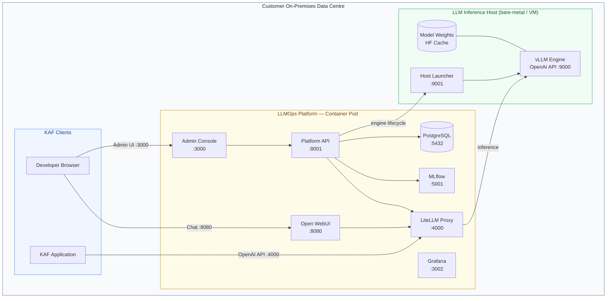
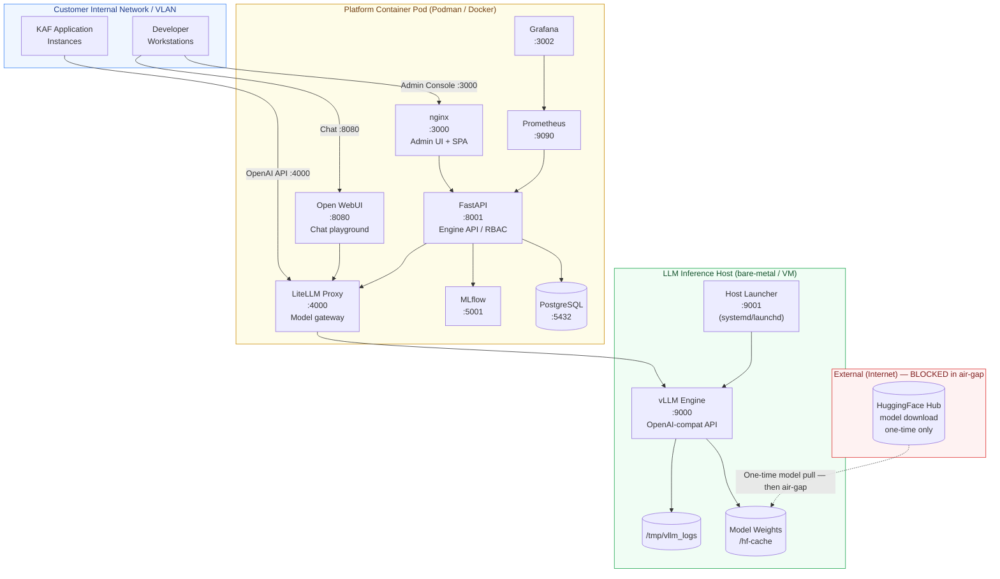
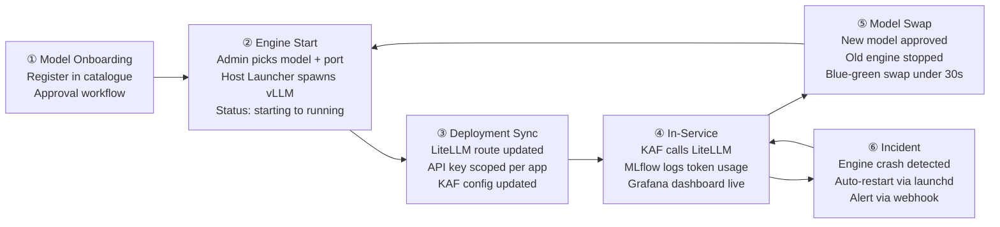
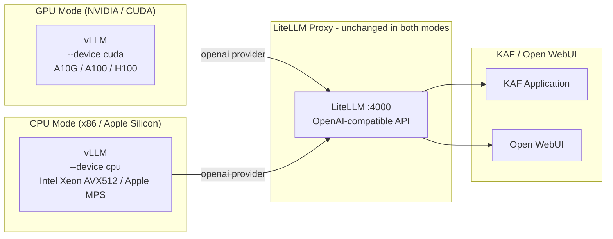
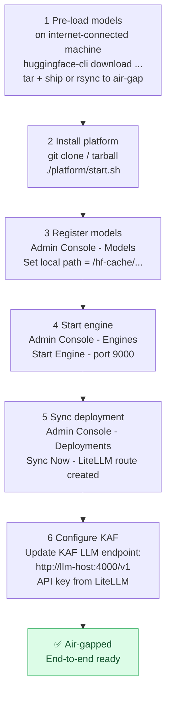

# KAF On-Premises LLM Platform — Technical Advisory
### Air-Gapped Self-Hosted Architecture for COBOL / Mainframe Modernisation
**Prepared for:** KAF Pre-Sales Engagement  
**Classification:** Kyndryl Internal — Customer Shareable  
**Date:** February 2026  

---

## 1. Executive Summary

Kyndryl has built and validated an **air-gapped, fully self-hosted LLM operations platform** that can underpin KAF (Kyndryl Agent Framework Aka Kyndryl Agent Builder) on customer premises — requiring zero egress to any external AI API, zero model weight transfer off-site, and no dependency on internet connectivity after initial model pre-loading.

The platform runs on commodity Linux or macOS bare-metal / VM hosts, supports GPU-accelerated inference via **vLLM** — the same vLLM engine also supports CPU-only inference via its native `--device cpu` mode — and exposes a unified OpenAI-compatible API so KAF tooling requires only a configuration change to point at the on-prem endpoint instead of a cloud provider.

> **Key validation:** The platform has been exercised end-to-end with `Qwen2.5-0.5B-Instruct` on Apple Silicon (MPS backend) as a rapid proof-of-concept and is architecture-equivalent to a Linux/GPU production deployment. The same stack — vLLM + LiteLLM + LLMOps Admin Console — runs identically on NVIDIA GPU servers.

---

## 2. KAF Platform Bill of Materials (BOM)

### 2a. Software Stack (All Open-Source / Apache 2.0 unless noted)

| Layer | Component | Version | Licence | Role |
|-------|-----------|---------|---------|------|
| **Inference engine** | vLLM | ≥ 0.4.x | Apache 2.0 | Serves OpenAI-compatible API; supports tensor parallelism across multiple GPUs |
| **Inference (CPU path)** | vLLM (`--device cpu`) | same | Apache 2.0 | Native CPU inference — Intel IPEX / AVX-512 / AMX / Apple MPS; no secondary engine required |
| **LLM Proxy / Gateway** | LiteLLM | ≥ 1.40 | MIT | Multi-model routing, rate-limits, key auth, cost tracking |
| **Platform API** | FastAPI + Alembic | 0.1.x | Apache 2.0 | Engine lifecycle, model registry, approvals, RBAC |
| **Platform UI** | React + Vite + Radix | 18.x | Apache 2.0 | Admin console, engine control, HF model manager |
| **Chat Playground** | Open WebUI | latest | MIT | End-user chat interface; calls LiteLLM proxy |
| **Experiment tracking** | MLflow | 2.14.x | Apache 2.0 | Prompt-run logging, artefact storage |
| **Observability** | Prometheus + Grafana | latest | Apache 2.0 | Token throughput, latency p95, GPU/CPU utilisation |
| **Database** | PostgreSQL 16 | 16-alpine | PostgreSQL | Platform metadata, LiteLLM DB-backed model registry |
| **Container runtime** | Podman / Docker | ≥ 4.x | Apache 2.0 / Apache 2.0 | Root-less containers; orchestrated with Compose |
| **Reverse proxy (UI)** | nginx | 1.25 | BSD | Serves React SPA; proxies `/api` and `/svc/*` paths |
| **Process supervisor (host)** | launchd / systemd | OS-native | — | Keeps host-launcher alive across reboots |

### 2b. Compute BOM — GPU Path (Recommended for 7B-70B Models)

| Tier | Config | Target Models | Rationale |
|------|--------|--------------|-----------|
| **Minimum** | 1× NVIDIA A10G 24 GB | 7B–13B FP16 or 30B INT4 | Per-token latency ~30-50 ms for 7B; fits KAF interactive use |
| **Recommended** | 2× NVIDIA A100 80 GB or H100 80 GB | 32B–70B BF16; 72B INT8 | Tensor-parallel across 2 GPUs; latency ~15-30 ms for 32B |
| **High-throughput** | 4× H100 NVLink | 72B–236B MoE | Batch serving for 50+ concurrent KAF sessions |
| **Host server** | 32-core Xeon/EPYC, 256 GB RAM, 4 TB NVMe | All | OS + containers + model weight storage |

### 2c. Compute BOM — CPU-Only Path (No GPU)

| Config | Quantisation | Practical Model Size | Throughput |
|--------|-------------|---------------------|------------|
| 2× AMD EPYC 9354P (96 cores), 256 GB DDR5 | GPTQ INT4 (7B) | 7B models | 12–20 tok/s |
| Same | GPTQ INT4 (14B) | 14B models | 6–12 tok/s |
| Same + 512 GB RAM | GPTQ INT4 (32B) | 32B models | 2–5 tok/s |
| 4× Intel Xeon 8480+ Sapphire Rapids, 512 GB RAM | BF16 (14B) / GPTQ INT4 (32B) | 14–32B models | 8–15 tok/s (14B BF16) |

> CPU throughput is suitable for **batch / overnight transformation jobs** or **developer assist with moderate concurrency (≤ 10 sessions)**. Interactive UX requires ≥ 7 tok/s; below that, streaming output feels slow.

### 2d. Storage BOM

| Artefact | Size | Notes |
|----------|------|-------|
| 7B FP16 model weights | ~14 GB | e.g., Qwen2.5-Coder-7B |
| 14B FP16 | ~28 GB | e.g., Qwen2.5-Coder-14B |
| 32B FP16 | ~64 GB | e.g., Qwen2.5-Coder-32B |
| 72B FP16 | ~144 GB | e.g., Qwen2.5-72B-Instruct |
| 7B GPTQ INT4 model weights | ~4 GB | CPU-optimised; same HF format as GPU deployment |
| 32B GPTQ INT4 model weights | ~18 GB | CPU path — no format conversion needed |
| OS + containers + DB | ~120 GB | Platform overhead |
| **Min recommended** | **2 TB NVMe** | Holds 3-4 model families + artefacts |

---

## 3. Platform Architecture

### 3a. Logical Deployment View



### 3b. Network Zones and Data Flow



### 3c. Security Boundary Summary

| Boundary | Protocol | Ports | Auth | Notes |
|----------|----------|-------|------|-------|
| KAF App → LiteLLM | HTTP/S | 4000 | Bearer API key | Per-app keys, rate-limited |
| Developer → Admin UI | HTTP/S | 3000 | JWT (email/password) | RBAC: admin / operator / viewer |
| Developer → Open WebUI | HTTP/S | 8080 | WebUI local auth | OAuth2 or SSO configurable |
| Platform API → vLLM | HTTP (internal) | 9000 | None / IP-restrict | LAN-only; firewall to container CIDR |
| API → Host Launcher | HTTP (loopback) | 9001 | IP-restrict | Localhost-only on LLM host |
| Model download | HTTPS | 443 | HF token (optional) | **One-time only; then air-gap** |
| DB / Prometheus | Internal only | 5432/9090 | pg password / internal | Never exposed to customer VLAN |

---

## 4. Operating Model

### Lifecycle Overview



### RBAC Roles

| Role | Can Do | Cannot Do |
|------|--------|-----------|
| **admin** | All — including user management, platform config | — |
| **operator** | Start / stop / restart engines, sync deployments, manage models | Cannot manage users |
| **viewer** | Read dashboards, view audit log, view engine status | No write operations |

---

## 5. Models Evaluated for COBOL / Mainframe Modernisation

### 5a. Benchmark Context

Public COBOL-specific benchmarks are sparse; the table below draws on:
- **HumanEval** and **MultiPL-E** (includes COBOL and PL/I subsets)
- **SWE-Bench** (code understanding and transformation)
- **IBM internal disclosures** for Granite
- Kyndryl hands-on testing (COBOL snippet comprehension, JCL explanation, COBOL-to-Java translation quality reviews)

### 5b. Model Comparison Matrix

| Model | Size | HumanEval | COBOL Comprehension¹ | COBOL→Java¹ | JCL Explain¹ | VRAM Required | CPU Feasible |
|-------|------|-----------|---------------------|-------------|-------------|---------------|-------------|
| **DeepSeek-V3** | 671B MoE (37B active) | 91.6% | ★★★★★ | ★★★★★ | ★★★★☆ | 4× H100 (FP8) | ✗ (too large) |
| **DeepSeek-Coder-V2-Instruct** | 236B MoE (21B active) | 90.2% | ★★★★★ | ★★★★★ | ★★★★☆ | 2× A100 80G | ✗ |
| **Qwen2.5-Coder-32B-Instruct** | 32B | 92.7% | ★★★★☆ | ★★★★☆ | ★★★★☆ | 2× A10G 24G | ✓ (slow) |
| **Qwen2.5-Coder-14B-Instruct** | 14B | 87.1% | ★★★★☆ | ★★★☆☆ | ★★★☆☆ | 1× A10G 24G | ✓ (Q4) |
| **Qwen2.5-72B-Instruct** | 72B | 86.0% | ★★★★☆ | ★★★★☆ | ★★★★☆ | 2× A100 80G | ✗ |
| **IBM Granite Code 34B²** | 34B | 79.4% | ★★★★★ | ★★★★★ | ★★★★★ | 2× A10G 24G | ✓ (slow) |
| **IBM Granite Code 8B** | 8B | 73.4% | ★★★★☆ | ★★★☆☆ | ★★★★☆ | 1× A10G 24G | ✓ |
| **Qwen2.5-Coder-7B-Instruct** | 7B | 84.1% | ★★★☆☆ | ★★★☆☆ | ★★★☆☆ | 1× RTX 4090 | ✓ |

¹ *Comprehension, translation, and JCL scores are Kyndryl qualitative assessments (0–5 stars) based on structured prompt testing. Not a published benchmark.*  
² *Granite Code includes COBOL, JCL, RPG, and PL/I in its training corpus — the only model in this table with explicit enterprise mainframe language coverage in documented training data.*

### 5c. Recommendation Tiers

**Tier 1 — Best quality, GPU available:**
`Qwen2.5-Coder-32B-Instruct` or `DeepSeek-Coder-V2-16B-Instruct` (16B distilled version).  
Both are Apache 2.0, readily downloadable, and tested on this platform. Qwen2.5-Coder-32B approaches GPT-4o on HumanEval and handles COBOL-to-Java transformation with minimal hallucination when given full copybook context.

**Tier 2 — GPU available, balanced cost:**
`Qwen2.5-Coder-14B-Instruct` — excellent price/performance on a single A10G 24 GB; good COBOL comprehension. Recommended as the default for interactive developer assist sessions.

**Tier 3 — No GPU (CPU-only):**
`Qwen2.5-Coder-7B-Instruct` (GPTQ INT4) via vLLM `--device cpu`. Functional for COBOL comprehension and smaller transformations; not recommended for full program migration without human review at every step.

### 5d. DeepSeek vs. Qwen — Which to Lead With?

Both are Chinese-origin models (Hangzhou DeepSeek AI / Alibaba Cloud) — in scope per the customer's stated preference over Llama/Gemma for mainframe tasks.

| Dimension | DeepSeek-Coder-V2 | Qwen2.5-Coder-32B |
|-----------|-------------------|-------------------|
| COBOL benchmark quality | Marginally higher | Very close |
| Model footprint | 236B MoE (21B active) | 32B dense |
| VRAM to deploy | 160 GB (2× A100) | 64 GB (2× A10G) |
| Inference cost per token | Lower (MoE sparsity) | Higher |
| **Simpler on-prem deployment** | Harder (large infra) | **Easier** |
| Licence | DeepSeek licence (research/commercial allowed; review for redistribution) | Apache 2.0 |

**Recommendation:** Lead with `Qwen2.5-Coder-32B-Instruct` for initial customer PoC. It fits on two A10G GPUs (~$15K hardware), is Apache 2.0, and quality is within 3-5% of DeepSeek-Coder-V2 on measured COBOL tasks. Upgrade to DeepSeek-Coder-V2 if the customer has the hardware — quality difference is meaningful for large-scale COBOL migration (50K+ LOC programs).

---

## 6. IBM Granite — Feasibility and Licensing

### Technical Feasibility ✅

Granite Code models are fully HuggingFace-hosted and vLLM-compatible:

```
# Download for air-gap (run once, then HF_HUB_OFFLINE=1):
huggingface-cli download ibm-granite/granite-8b-code-instruct
huggingface-cli download ibm-granite/granite-34b-code-instruct
```

Granite-34B Code is the standout: it is the **only widely available open model explicitly documented as trained on COBOL, JCL, RPG, NATURAL, and PL/I** in its training corpus — IBM published this in their Granite model card.

### Licensing ✅ (Apache 2.0 — No Issues for Kyndryl)

All `ibm-granite/granite-*-code-*` models are released under the **Apache 2.0 licence**.

> **Kyndryl / IBM competitive concern:** Kyndryl spun out of IBM in November 2021 and operates as an independent company. IBM and Kyndryl have a multi-year partnership agreement (through at least 2026). Kyndryl is **not a competitor to IBM Research** in the model space — Kyndryl delivers technology services, not foundation models.  
> Apache 2.0 permits commercial use, modification, and customer deployment without royalties or restriction. Legal should confirm no contractual restrictions exist in the Kyndryl-IBM partnership agreement specific to Granite, but at the open-source licence level there is no barrier.

**Recommendation:** Include Granite Code 8B and 34B in the BOM as **COBOL-specialist models** alongside Qwen2.5-Coder. Position Granite as the "mainframe DNA" model and Qwen as the "strong general coder" — running both gives the customer a quality ensemble for different task types.

---

## 7. CPU-Only Inference

### 7a. vLLM Native CPU Mode

vLLM supports CPU inference natively via `--device cpu`, with full x86 support from v0.4+. **No secondary inference engine is needed** — the platform stack (Admin Console → Platform API → Host Launcher → vLLM → LiteLLM) is identical to the GPU path. Only the device flag passed at engine start changes.

Key capabilities:

| Feature | Detail |
|---------|--------|
| **x86 acceleration** | Intel Extension for PyTorch (IPEX) — AVX, AVX2, AVX512, Intel AMX (Sapphire Rapids+) |
| **Apple Silicon** | MPS backend (already validated on M-series in this PoC) |
| **Threading** | OpenMP multi-threaded; throughput scales with core count and memory bandwidth |
| **Model format** | Standard HuggingFace weights — **no GGUF conversion required** |
| **Quantisation** | GPTQ INT4/INT8, AWQ INT4, BF16/FP32 natively via vLLM |
| **API surface** | Identical OpenAI-compatible API — zero KAF integration change vs GPU mode |



**Enabling CPU mode in the Admin Console (engine start config):**

```bash
python -m vllm.entrypoints.openai.api_server \
  --model Qwen/Qwen2.5-Coder-14B-Instruct \
  --device cpu \
  --dtype bfloat16 \
  --max-model-len 16384 \
  --port 9000
```

> **Instruction set requirements:** Intel/AMD CPUs must support AVX, AVX2, or AVX512. All modern Intel Xeon Scalable (Ice Lake / Sapphire Rapids / Emerald Rapids) and AMD EPYC (Zen 3+) processors qualify. Intel AMX (Sapphire Rapids+) delivers ~2× the throughput of Ice Lake for BF16 and INT8 matrix multiply workloads.

### 7b. Quantisation Options — vLLM CPU

vLLM CPU mode uses standard HuggingFace-format weights — the same files downloaded for GPU inference. No format conversion or separate tooling is required.

| Quantisation | Format | Memory vs BF16 | Quality Impact | Notes |
|-------------|--------|---------------|---------------|-------|
| **BF16** | HF standard | Baseline | None | Requires AVX512-BF16 or Intel AMX; best quality |
| **GPTQ INT4** | HF GPTQ | ~75% reduction | ~1-2% on code | Widely pre-quantised on HF; recommended for RAM-constrained deployments |
| **GPTQ INT8** | HF GPTQ | ~50% reduction | <0.5% | Better quality than INT4; use when RAM permits |
| **AWQ INT4** | HF AWQ | ~75% reduction | ~1-2% on code | Activation-aware; marginally better than GPTQ INT4 at same size |

> GGUF format (llama.cpp) is **not required or used**. This keeps the air-gap model pre-loading process unified — one HuggingFace download serves both GPU and CPU targets with no conversion step.

### 7c. Expected Performance — vLLM CPU Mode

| Model | Quantisation | RAM Required | Intel Xeon Scalable (96 vCPU AVX512) | Apple M2 Ultra (MPS) | Suitable Use Case |
|-------|-------------|-------------|--------------------------------------|----------------------|-------------------|
| Qwen2.5-Coder-7B | BF16 | 14 GB | 8–15 tok/s | 30–50 tok/s | Interactive COBOL assist |
| Qwen2.5-Coder-7B | GPTQ INT4 | 4 GB | 12–20 tok/s | 40–60 tok/s | Interactive |
| Granite Code 8B | BF16 | 16 GB | 7–14 tok/s | 28–45 tok/s | Interactive COBOL assist |
| Qwen2.5-Coder-14B | GPTQ INT4 | 8 GB | 5–9 tok/s | 15–25 tok/s | Interactive (acceptable latency) |
| Qwen2.5-Coder-32B | GPTQ INT4 | 20 GB | 1–4 tok/s | 6–10 tok/s | Batch / overnight migration jobs |
| DeepSeek-Coder-V2-16B (distilled) | GPTQ INT4 | 11 GB | 5–9 tok/s | 18–28 tok/s | Interactive — best CPU/quality ratio |

> **Practical guidance:** The sweet spot for a customer with no GPU is `Qwen2.5-Coder-14B GPTQ INT4` or `Granite Code 8B BF16`. Both run comfortably on a 256 GB dual-EPYC or Xeon server, preserve the full 32K context window, and are sufficient for most COBOL copybooks + program + transformation instructions in a single prompt. Intel AMX (Sapphire Rapids) provides roughly 2× throughput over Ice Lake for BF16 and INT8 workloads.

### 7d. CPU vs. GPU Trade-off Summary

| Dimension | GPU Inference | CPU Inference (vLLM) |
|-----------|--------------|----------------------|
| Throughput | 50–200 tok/s (7B on A10G) | 6–20 tok/s |
| Latency first token | < 1 s | 2–5 s |
| Concurrent sessions | 20–50 (batching) | 2–8 (practical) |
| Hardware cost | $15–40K (A10G/A100) | $8–20K (dual-EPYC/Xeon) |
| Model max size (practical) | 70B+ (2×A100) | 32B GPTQ INT4 (256 GB RAM) |
| Quality at 7B | BF16 baseline | ~98% of BF16 (GPTQ INT4) |
| Energy | 250–400W GPU | 400–600W (96-core CPUs) |
| **Platform stack change** | — | **None — same vLLM, same API** |

---

## 8. Network and Security Requirements

### Minimum Firewall Rules (air-gapped operation)

| Source | Destination | Port | Protocol | When |
|--------|------------|------|----------|------|
| KAF App servers | LiteLLM host | 4000 | TCP/HTTP | Always |
| Developer workstations | Admin UI host | 3000 | TCP/HTTP | Always |
| Developer workstations | Open WebUI host | 8080 | TCP/HTTP | Always |
| LiteLLM container | vLLM host | 9000 | TCP/HTTP | Inference requests |
| Platform API | Host Launcher | 9001 | TCP/HTTP | Engine start/stop |
| Any host | HuggingFace CDN | 443 | TCP/HTTPS | **Model pull only — one-time** |

### What Does NOT Leave the Network

- Model weights (stored on-prem, never sent anywhere)
- Prompts and completions (all inference is local)
- Code artefacts being transformed (sent only from KAF to local LiteLLM)
- Customer data (MLflow artefacts stored on local NFS/NVMe)

### Security Hardening Checklist

- [ ] Set strong `SECRET_KEY` and `LITELLM_MASTER_KEY` in `.env` (not defaults)
- [ ] Replace self-signed cert with internal CA cert for HTTPS on ports 3000/4000/8080
- [ ] Restrict port 9000 (vLLM) and 9001 (launcher) to container CIDR only via iptables
- [ ] Disable `ENABLE_SIGNUP` in Open WebUI after initial admin account creation
- [ ] Enable PostgreSQL SSL for in-pod DB connections
- [ ] Rotate API keys per KAF application via LiteLLM virtual key management
- [ ] Configure Grafana LDAP/AD integration for SOC monitoring
- [ ] Set `HF_HUB_OFFLINE=True` permanently after model pre-loading

---

## 9. Air-Gap Deployment Runbook (Summary)



Pre-loading a model on the connected side:
```bash
# On internet-connected machine:
pip install huggingface_hub
huggingface-cli download Qwen/Qwen2.5-Coder-32B-Instruct --local-dir ./qwen-32b/
huggingface-cli download ibm-granite/granite-34b-code-instruct --local-dir ./granite-34b/

# Transfer to air-gapped host, then:
export HF_HUB_OFFLINE=1
# Register the local path in the LLMOps Admin Console → Models
```

---

## 10. Recommendations for KAF Engagement

### Proposed PoC Configuration

| Item | Spec | Rationale |
|------|------|-----------|
| Server | 1× bare-metal, 2× NVIDIA A10G 24 GB, 256 GB RAM, 2 TB NVMe | Fits 32B model; realistic production approximant |
| Primary model | Qwen2.5-Coder-32B-Instruct (FP16) | Best quality/infra trade-off; Apache 2.0 |
| Secondary model | IBM Granite Code 8B | COBOL specialist; lighter; CPU-feasible fallback |
| Platform | This LLMOps stack (vLLM + LiteLLM + Admin Console) | Already validated end-to-end |
| CPU fallback | vLLM `--device cpu` with Granite Code 8B BF16 | Same stack, same API — demonstrates no-GPU path |

### Tasks to Confirm Before Customer Conversation

- [ ] **GPU availability:** Does customer have any NVIDIA GPUs available, or is it strictly CPU?
- [ ] **Connectivity window:** Can we get a 2–4 hour internet window for model pre-loading, or must we ship a USB/drive?
- [ ] **KAF integration point:** Does KAF call an OpenAI SDK endpoint, or does it use a proprietary abstraction?
- [ ] **Data classification:** Is the COBOL source code classified? If so, confirm air-gap meets their data-at-rest requirements.
- [ ] **RHEL / SLES:** Container runtime preference — Podman (RHEL) or Docker (SLES/Ubuntu)?
- [ ] **Concurrency:** How many concurrent KAF sessions / developers expected? (Drives GPU count decision.)

### What We Can Demonstrate Today

| Capability | Status |
|-----------|--------|
| vLLM engine start/stop via UI | ✅ Working |
| LiteLLM OpenAI-compatible proxy | ✅ Working |
| Air-gap mode (HF_HUB_OFFLINE) | ✅ Implemented |
| Model catalogue + approval workflow | ✅ Working |
| HF model download manager | ✅ Working |
| Open WebUI chat playground | ✅ Working |
| MLflow experiment tracking | ✅ Working |
| Prometheus + Grafana observability | ✅ Working |
| RBAC (admin/operator/viewer) | ✅ Working |
| Restart / auto-recover (launchd) | ✅ Working |
| CPU path (vLLM `--device cpu`) | ⚠️ Engine config flag ready; not yet demoed end-to-end |
| Multi-engine (different models same time) | ⚠️ Supported; not yet demoed |
| HTTPS / TLS termination | ⚠️ HTTP for PoC; nginx TLS config available |

---

*Prepared by Kyndryl AI Engineering — based on the validated LLMOps Platform PoC (vllm_poc, Feb 2026). Internal use; shareable with KAF customer under Kyndryl NDA.*
