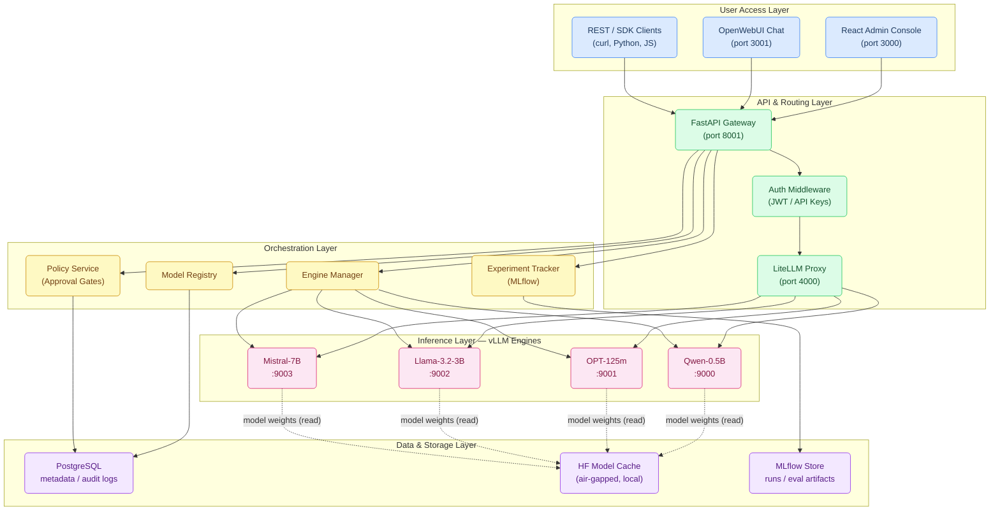
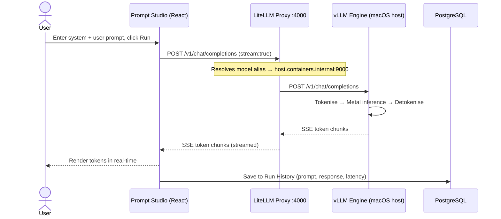
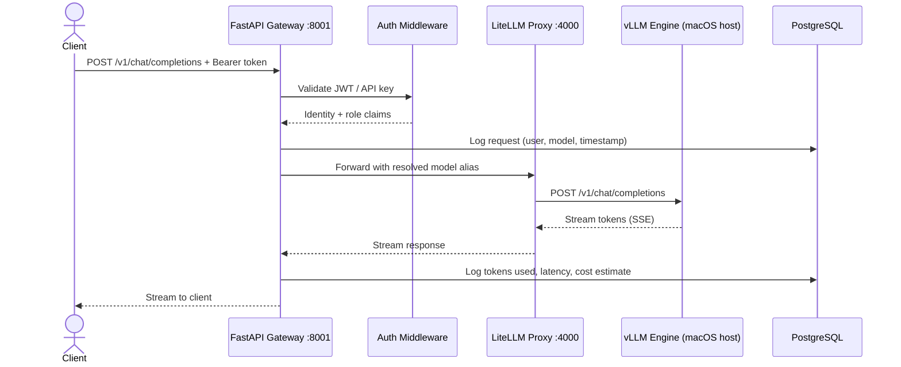
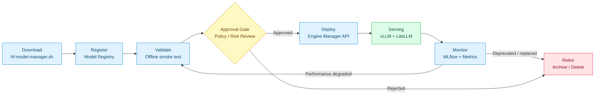
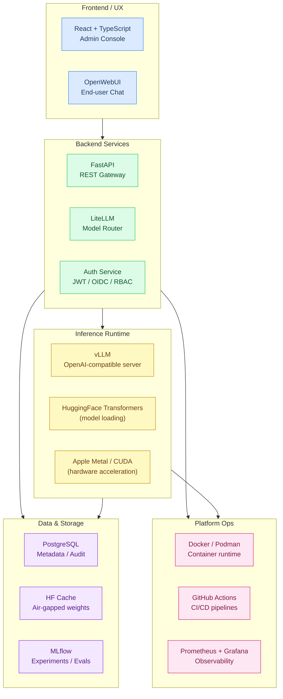
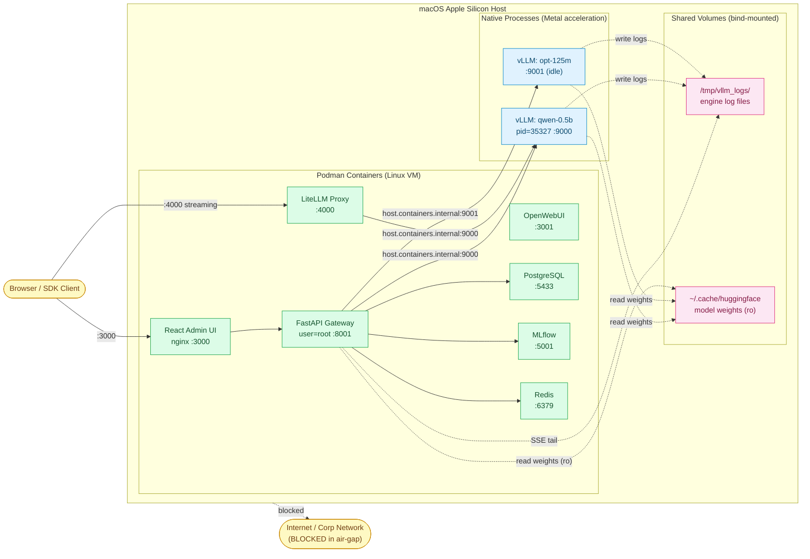

# LLMOps Platform — Architecture & Implementation Plan

> **Purpose:** Executive / peer socialisation document for a self-hosted, air-gapped LLMOps platform built for regulated enterprise customers.
>
> **Prototype status:** The bash-script tooling (`hf-model-manager.sh`, `vllm-engine-manager.sh`,  
> `litellm-config.yaml`, `docker-compose.yml`) **remains intact and fully functional** as a live demo vehicle throughout all phases.
>
> **Current status (2026-02-26):** Phases 0–4 complete and validated end-to-end. Qwen2.5-0.5B-Instruct running live on Apple Metal with streaming responses confirmed in Prompt Studio. Phase 5 (Enterprise Hardening) starting now.

---

## 1. Platform Architecture Overview

End-to-end view of all layers — from user-facing interfaces down to air-gapped model storage.



---

## 2. Request Flow — Prompt to Response

Two distinct paths depending on context — interactive streaming vs governed API.

### 2a. Prompt Studio (Interactive / Streaming)

Prompt Studio calls LiteLLM directly to eliminate proxy latency and allow native SSE streaming to the browser.



### 2b. Governed API Path (SDK / Automation)

All SDK clients and automation go through FastAPI for auth, audit, and governance enforcement.



---

## 3. Model Lifecycle — Governance-First Flow

Every model passes through approval gates before serving traffic.  
**Fail-fast at validation keeps unsafe or unstable models out of production.**



---

## 4. Technology Stack — Building Blocks by Layer



---

## 5. Deployment Topology — Hybrid Native + Container (Validated)

Actual running topology on macOS Apple Silicon. vLLM engines run natively for Metal acceleration; all platform services run in Podman containers. The two halves communicate via `host.containers.internal`.



**Key wiring details:**

| Concern | Solution |
|---|---|
| Container → host vLLM | `extra_hosts: host.containers.internal:host-gateway` in docker-compose |
| HF cache readable by API container | `user: "0"` (run as root); cache bind-mounted from host |
| Log sharing (vLLM writes, API SSE reads) | `/tmp/vllm_logs` bind-mounted into API container |
| Reconciler PID check | Falls back to port-reachability check when host PIDs invisible from container |
| LiteLLM auth across restarts | Master key SHA256 hash persisted in PostgreSQL `LiteLLM_VerificationToken` |

---

## 6. Implementation Roadmap

```mermaid
gantt
    title LLMOps Platform — Phased Implementation Roadmap
    dateFormat  YYYY-MM-DD
    axisFormat  %b %d

    section Phase 0 · Prototype ✅
    Bash TUI - model manager        :done, p0a, 2026-01-01, 2026-02-15
    Bash TUI - engine manager       :done, p0b, 2026-01-01, 2026-02-15
    LiteLLM + OpenWebUI wiring      :done, p0c, 2026-02-01, 2026-02-22
    Air-gap + offline support       :done, p0d, 2026-02-10, 2026-02-22

    section Phase 1 · Backend Foundation ✅
    FastAPI project scaffold        :done, p1a, 2026-02-23, 2026-02-24
    PostgreSQL schema + migrations  :done, p1b, 2026-02-23, 2026-02-24
    Model Registry API (CRUD)       :done, p1c, 2026-02-24, 2026-02-25
    Engine lifecycle REST API       :done, p1d, 2026-02-24, 2026-02-25
    JWT auth + API keys             :done, p1e, 2026-02-25, 2026-02-26
    Audit log middleware            :done, p1f, 2026-02-25, 2026-02-26
    Milestone: API demo ready       :milestone, done, m1, 2026-02-26, 0d

    section Phase 2 · LLMOps Core ✅
    MLflow integration              :done, p2a, 2026-02-23, 2026-02-24
    Model evaluation harness        :done, p2b, 2026-02-23, 2026-02-24
    Policy / approval workflow      :done, p2c, 2026-02-24, 2026-02-25
    Prometheus metrics export       :done, p2d, 2026-02-24, 2026-02-25
    A/B traffic split routing       :done, p2e, 2026-02-25, 2026-02-26
    Cost & token usage tracking     :done, p2f, 2026-02-25, 2026-02-26
    Milestone: End-to-end governed  :milestone, done, m2, 2026-02-26, 0d

    section Phase 3 · Admin Console ✅
    React project scaffold          :done, p3a, 2026-02-23, 2026-02-24
    Model catalogue view            :done, p3b, 2026-02-23, 2026-02-24
    Engine control panel            :done, p3c, 2026-02-24, 2026-02-25
    Prompt Studio (streaming)       :done, p3d, 2026-02-24, 2026-02-25
    Log drawer SSE                  :done, p3e, 2026-02-25, 2026-02-26
    User + role management UI       :done, p3f, 2026-02-25, 2026-02-26
    Milestone: UI demo ready        :milestone, done, m3, 2026-02-26, 0d

    section Phase 4 · Hybrid Infra & Hardening ✅
    Hybrid host+container engine arch   :done, p4a, 2026-02-25, 2026-02-26
    Reconciler dual-host port check     :done, p4b, 2026-02-25, 2026-02-26
    LiteLLM deployment sync API         :done, p4c, 2026-02-25, 2026-02-26
    Shared log volume (SSE tail)        :done, p4d, 2026-02-25, 2026-02-26
    Alembic volume mount (hot reload)   :done, p4e, 2026-02-25, 2026-02-26
    E2E validation (live streaming)     :done, p4f, 2026-02-25, 2026-02-26
    Milestone: E2E validated            :milestone, done, m4, 2026-02-26, 0d

    section Phase 5 · Enterprise Hardening (Active)
    OIDC / SSO integration          :active, p5a, 2026-02-26, 14d
    Fine-grained RBAC               :p5b, 2026-03-05, 7d
    SCIM user provisioning          :p5c, 2026-03-05, 7d
    Grafana observability stack     :p5d, 2026-03-12, 7d
    Structured JSON logging / SIEM  :p5e, 2026-03-12, 7d
    Air-gap certification package   :p5f, 2026-03-19, 7d
    Compliance audit reports        :p5g, 2026-03-19, 7d
    Load testing + perf tuning      :p5h, 2026-03-26, 7d
    Docs + runbooks                 :p5i, 2026-03-26, 7d
    Milestone: Production-ready     :milestone, m5, 2026-04-05, 0d
```

---

## 7. Detailed Implementation Plan

### Phase 0 — Prototype ✅ (Complete)

| Component | Status | Notes |
|---|---|---|
| `hf-model-manager.sh` | ✅ Done | TUI for HuggingFace downloads, dual-cache support |
| `vllm-engine-manager.sh` | ✅ Done | TUI for vLLM start/stop/logs, offline mode |
| `litellm-config.yaml` | ✅ Done | 4 models on ports 9000–9003 |
| `docker-compose.yml` | ✅ Done | LiteLLM + OpenWebUI via Podman |
| Air-gap operation | ✅ Done | `HF_HUB_OFFLINE=1`, local path resolution |

> **Preserve as-is.** These scripts remain the fastest demo vehicle throughout all phases.

---

### Phase 1 — Backend Foundation ✅ (Complete — 2026-02-26)

**Goal:** Replace bash scripts with a proper REST API that can be integrated, tested, and deployed reliably.

#### 1.1 FastAPI Project Scaffold
- Monorepo layout: `platform/api/`, `platform/ui/`, `platform/infra/`
- FastAPI with async SQLAlchemy, Alembic for migrations
- Pydantic v2 schemas for all request/response models
- Dockerised with health checks

#### 1.2 PostgreSQL Schema
```
models          → id, repo_id, alias, version, status, registered_by, created_at
engines         → id, model_id, port, status, pid, started_at, config_json
requests_log    → id, engine_id, user_id, prompt_tokens, completion_tokens, latency_ms, ts
api_keys        → id, user_id, key_hash, scopes, expires_at
users           → id, email, role (admin / operator / viewer), created_at
```

#### 1.3 Engine Lifecycle API
- `POST /engines/start` — start a vLLM engine for a registered model
- `POST /engines/{id}/stop` — graceful shutdown
- `GET  /engines` — list running engines with status + metrics
- `GET  /engines/{id}/logs` — SSE log streaming (replace `less +F`)

#### 1.4 Model Registry API
- `POST /models` — register a new model from HF cache
- `GET  /models` — catalogue with metadata, version, eval scores
- `PATCH /models/{id}/status` — promote / retire model

#### 1.5 Auth
- JWT bearer tokens with role claims (`admin`, `operator`, `viewer`)
- API key support for non-interactive clients (matching LiteLLM `master_key` pattern)
- Middleware that logs every authenticated request to `requests_log`

**Deliverable:** ✅ FastAPI app running in Podman, all CRUD routes live, JWT auth with role claims, Alembic migrations managed via host volume mount.

---

### Phase 2 — LLMOps Core ✅ (Complete — 2026-02-26)

**Goal:** Add the governance, evaluation, and observability primitives that differentiate this from a plain vLLM wrapper.

#### 2.1 MLflow Integration
- Auto-create an MLflow experiment per model
- Log evaluation runs: MMLU subset, MT-Bench prompts, latency percentiles
- Register champion model versions in MLflow Model Registry
- Surface run IDs in the Model Registry API response

#### 2.2 Policy & Approval Workflow
- `POST /models/{id}/request-approval` — operator submits model for review
- `POST /models/{id}/approve` / `/reject` — admin decision with notes
- Email / Slack webhook notification on state changes (pluggable)
- Approval required before engine can be started in production mode

#### 2.3 Prometheus Metrics
- `vllm_requests_total`, `vllm_tokens_per_second`, `vllm_queue_depth`
- FastAPI middleware emitting `http_request_duration_seconds` histogram
- Separate Prometheus scrape endpoint at `/metrics`

#### 2.4 A/B Routing
- LiteLLM `model_list` weight-based splitting (e.g. 80% Llama / 20% Mistral)
- API to adjust weights at runtime without restart
- Results tracked per variant in MLflow for statistical comparison

#### 2.5 Cost & Token Tracking
- Per-request token counts to `requests_log`
- Aggregate cost estimate API: `GET /reports/cost?from=&to=&model=`
- CSV export for finance/compliance

**Deliverable:** ✅ Approval workflow live — model registered → approval requested → approved → engine running. Prometheus metrics scraped from vLLM `/metrics` endpoint every 30s.

---

### Phase 3 — React Admin Console ✅ (Complete — 2026-02-26)

**Goal:** Replace manual CLI/TUI use with a polished UI that any operator (non-engineer) can use confidently.

#### 3.1 Stack
- React 18 + TypeScript + Vite
- TailwindCSS + Shadcn/ui component library
- TanStack Query for API state management
- Recharts for metrics visualisation

#### 3.2 Views
| Screen | Features |
|---|---|
| **Model Catalogue** | List, filter, register new model, view eval scores, promote/retire |
| **Engine Control Panel** | Start/stop engines, live log tail, port/config management |
| **Request Dashboard** | Token usage trends, latency P50/P95/P99, top users |
| **MLflow Browser** | Embedded iframe or native experiment listing, compare runs |
| **User Management** | Invite users, assign roles, manage API keys |
| **Audit Log** | Searchable, filterable, CSV export |

#### 3.3 Real-Time Features
- SSE log streaming from `GET /engines/{id}/logs`
- Polling engine status every 5 s with `react-query` refetchInterval
- Toast notifications on approval workflow state changes

**Deliverable:** ✅ React admin console live at `localhost:3000`. Prompt Studio streaming confirmed with Qwen2.5-0.5B-Instruct (8.4 tokens/s generation throughput on Apple Metal). SSE log drawer working. Run History persisted.

---

### Phase 4 — Hybrid Infrastructure & Hardening ✅ (Complete — 2026-02-26)

**Goal:** Resolve the macOS-specific hybrid architecture challenges and validate the full stack end-to-end.

#### 4.1 Hybrid Engine Architecture
- vLLM runs natively on macOS host for full Metal/CPU acceleration (no Podman VM overhead)
- API container reaches host engines via `host.containers.internal` (set via `extra_hosts` in docker-compose)
- Engine lifecycle: API stores metadata in Postgres; reconciler polls `host.containers.internal:{port}` every 30s

#### 4.2 Reconciler + Metrics Dual-Host Fix
- `_engine_port_reachable()` tries both `127.0.0.1` AND `host.containers.internal` — handles both local-dev and container-to-host scenarios
- PID liveness check falls back to port reachability when container PID namespace ≠ host PID namespace
- `scrape_engine_metrics()` updated with same dual-host loop

#### 4.3 LiteLLM Deployment Sync
- `POST /v1/deployments/sync` auto-registers running engines with LiteLLM model registry
- LiteLLM master key SHA256 hash persisted in `LiteLLM_VerificationToken` (survives container restarts)
- Stale deployments pruned automatically on each sync cycle

#### 4.4 Volume Mount Strategy
- `./api/alembic:/app/alembic:ro` — host alembic dir always shadows image (no rebuild for migrations)
- `./api/app:/app/app:ro` — live Python code sync (restart container, no image rebuild)
- `/tmp/vllm_logs:/tmp/vllm_logs` — shared log dir: vLLM writes, API SSE endpoint tails
- `~/.cache/huggingface:/root/.cache/huggingface:ro` — model weights readable by API for registration

#### 4.5 E2E Validation
- Model registered → approval requested → approved → engine started → LiteLLM synced → streaming response confirmed
- Prompt Studio: Qwen2.5-0.5B explaining LLMs to a 10-year-old, streamed token-by-token ✅
- Log drawer SSE: vLLM boot log and inference logs streamed in real-time ✅

**Deliverable:** ✅ Full end-to-end stack validated live.

---

### Phase 5 — Enterprise Hardening 🔄 (Starting 2026-02-26)

**Goal:** Make the platform production-grade for regulated environments (FSI, healthcare, defence).

#### 5.1 RBAC + SSO/OIDC
- Integrate with corporate Identity Provider (Okta, Azure AD, Keycloak)
- Fine-grained RBAC: who can start which model on which environment
- SCIM provisioning for automated user lifecycle management
- MFA enforcement for admin/operator roles
- Session management + JWT refresh token rotation

#### 5.2 Observability Stack
- Grafana dashboards: system health, model performance, token budget alerts
- Alert rules: engine down, error rate spike, cost threshold breach
- Structured JSON logging → centralised SIEM (Splunk / ELK compatible)
- Prometheus alertmanager integration

#### 5.3 Air-Gap Certification Package
- Offline container images tarball (`podman save …`)
- Reproducible setup script validated against a fresh VM with no internet
- Bill of materials (SBOM) for every dependency
- Data-at-rest: model weights + DB encrypted with customer-managed keys

#### 5.4 Compliance & Audit
- Immutable audit log (append-only table, hash-chained for tamper evidence)
- GDPR / data residency: PII annotation fields, purge API
- Signed API responses with model version hash for reproducibility
- Quarterly model performance attestation report (PDF export)

#### 5.5 Performance & Scale
- Horizontal scaling: multiple vLLM workers behind LiteLLM load balancer
- KV-cache warm-up on engine start for larger models
- Benchmark suite (`benchmarks/benchmark_serving.py`) wired to CI
- Graceful engine drain + zero-downtime model swap

**Deliverable:** Air-gap install playbook + security review pack for customer procurement.

---

## 8. Key Design Principles

| Principle | Application |
|---|---|
| **Air-gap first** | All dependencies vendored; zero runtime internet calls |
| **Governance by default** | No model serves traffic without approval gate |
| **Audit everything** | Every request, every config change, every login logged immutably |
| **Backwards compatible** | Bash scripts remain functional; API is an additive layer |
| **Incremental delivery** | Each phase delivers a shippable, demo-able milestone |
| **Open standards** | OpenAI-compatible API means any existing client works unchanged |

---

## 9. Technology Choices — Rationale

| Choice | Why |
|---|---|
| **vLLM** | Best OSS throughput for regulated on-prem; OpenAI-compatible; Metal + CUDA |
| **LiteLLM** | Thin, well-maintained routing layer; avoids building model routing from scratch |
| **FastAPI** | Async Python, auto-generated OpenAPI docs, native Pydantic integration |
| **PostgreSQL** | Reliable, auditable, ACID, supported by every enterprise DBA team |
| **MLflow** | De facto standard for ML experiment tracking; self-hosted, no cloud dependency |
| **React + Shadcn** | Modern, accessible, rapid prototyping with enterprise-grade components |
| **Podman** | Rootless containers — preferred in hardened enterprise Linux environments |

---

*Document version: 2026-02-26 · Phases 0–4 complete and E2E validated · Phase 5 starting · For internal circulation and executive review*
